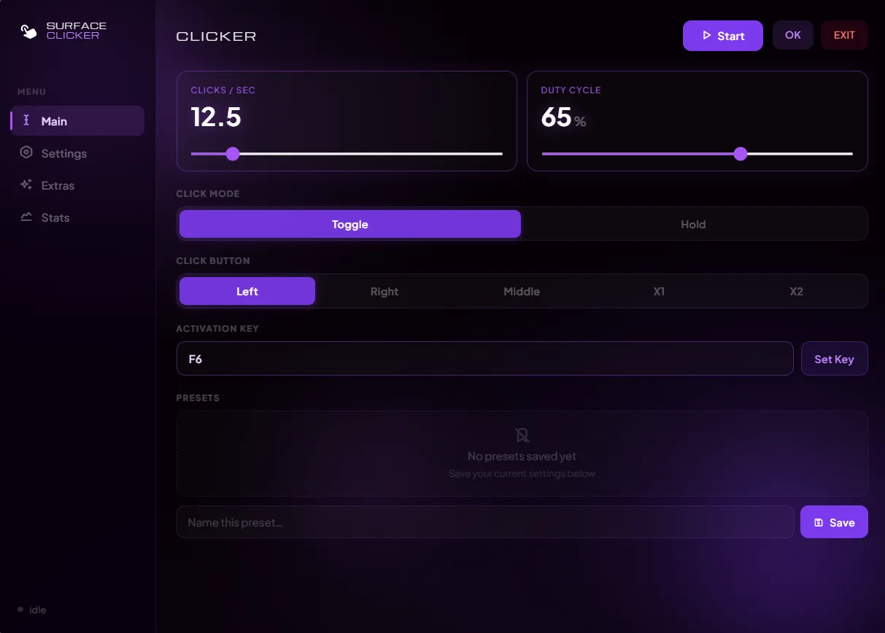

# SURFACE CLICKER

Surface Clicker is made by Deen and Claude AI. Logo is designed by Enward. Surface Clicker is an auto clicker focused on "Roblox BedWars" but also for any other tasks. It has many features such as 
- `EDGE CORNER STOP`
- `APP LOCK`
- `CPS, CDC`
- `THEME CUSTOMIZATION`
- `PRESETS`
- `HOLD/TOGGLE MODE`
- `OVERLAY FEATURE`

## HOW TO GET SURFACE CLICKER

Go to Releases and download the EXE from there.

Alternatively, you can build it yourself by forking it.

`NPM INSTALL`
`NPM START`

## KNOWN ISSUES

- While downloading the EXE, Windows Defender most likely will stop it and it might say it has a virus. This is because this exe is a unsigned EXE. Also it uses uiohook-napi which installs a global keyboard/mouse hook which uses the exact same technique of what RATS/Keyloggers do. Due to this cause, this file is false positive.

- On some builds, an unexpected system permission/location prompt appears when running the packaged `.exe`. Root cause not yet confirmed (likely `uiohook-napi` or a leftover renderer API call)

## LICENSE

This project is licensed under the GPL-3.0 License — see the [LICENSE](LICENSE) file for details.

